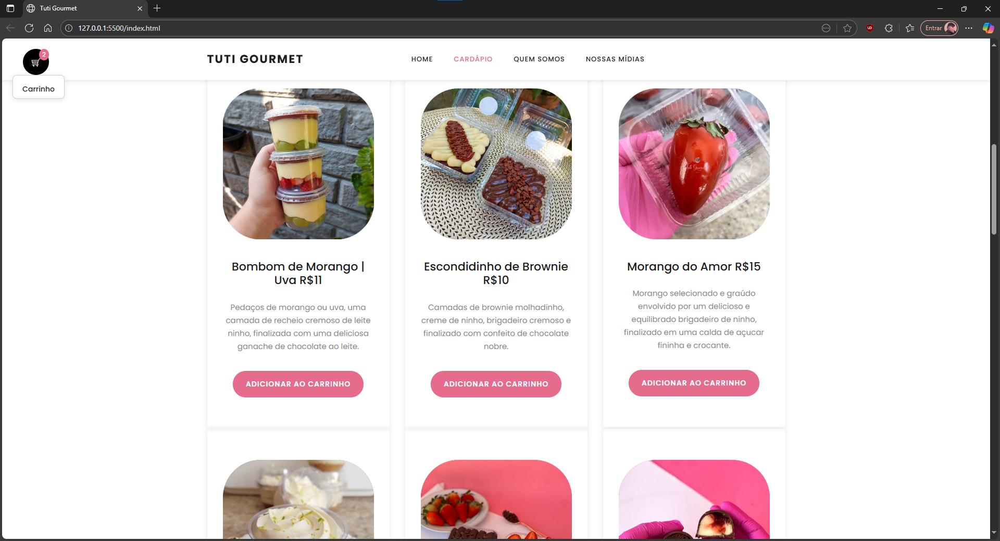

# Tuti Gourmet

[🔗 Acesse o site](https://tutigourmet.vercel.app)  
> Segunda tentativa de criar um site para a doceria da minha irmã.  
> A primeira versão foi importante para aprender, mas preferi recomeçar do zero e aplicar o que evoluí.  
> 💻 Projeto feito com HTML, CSS e JavaScript puro, com integração ao WhatsApp e foco em responsividade.

---

   

---

# Funcionalidades

- 🍽️ **Cardápio dinâmico** com produtos cadastrados via HTML  
- 🛒 **Carrinho flutuante inteligente**:  
  - Abre/fecha com botão flutuante  
  - Minimiza automaticamente ao rolar a página  
  - Permite alterar quantidades diretamente no input  
  - Atualiza o total em tempo real  
- 📲 **Finalização do pedido via WhatsApp**, com geração automática da mensagem formatada  
- 🎨 **Design moderno e acolhedor**, focado em uma doceria artesanal  
- 📱 **Responsivo** para dispositivos móveis e tablets  
- 💡 Código totalmente comentado, ideal para estudo, manutenção e evolução futura  

---

# Screenshot

---

# Sobre

Esse projeto foi desenvolvido como parte dos meus estudos de ADS (na Afya) e JavaScript (Curso em Vídeo), com o objetivo de praticar lógica de programação, responsividade e integração com serviços externos.

Foi minha **segunda tentativa de criar um site real para a doceria da minha irmã**. A primeira versão me ajudou a aprender bastante, mas preferi começar uma nova do zero, aplicando o que evoluí tecnicamente — principalmente em estrutura de código, design e usabilidade.

---

# Contato

**Bruno dos Santos Carvalho**  
📧 [bnocrv@proton.me](mailto:bnocrv@proton.me)  
🔗 [github.com/bnocrv](https://github.com/bnocrv)

---

# Licença

Este projeto está licenciado sob a Licença MIT.  
Sinta-se à vontade para usar, modificar e compartilhar — com os devidos créditos.

---

**Tuti Gourmet** — *Doces com amor. Momentos com sabor.* 🍬
